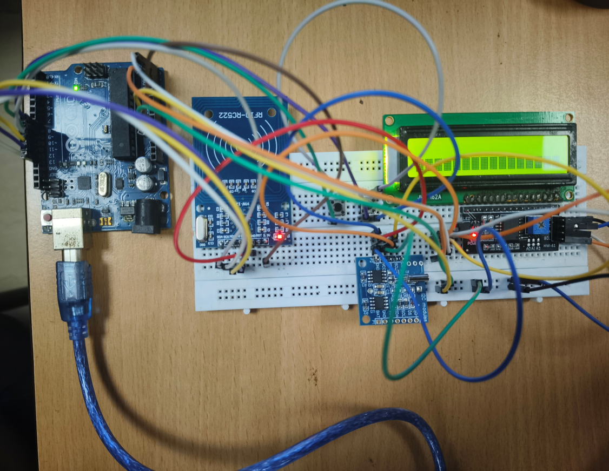
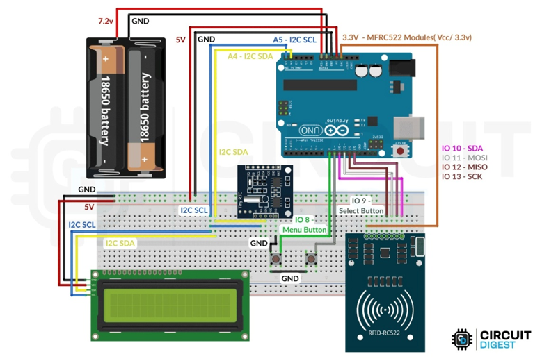

# RFID Attendance System

An Arduino-based RFID attendance system designed to automate attendance recording using RFID cards, real-time clock functionality, and non-volatile memory.

## 📸 Project Setup



## 📌 Overview

This project uses an Arduino Uno as the central controller to identify users through RFID cards and record their attendance.

The system uses the MFRC522 RFID reader to read RFID card UIDs, a DS1307 RTC module to provide date and time information, and the AT24C32 EEPROM attached to the RTC module to store attendance records even when the system is powered off.

A 16×2 I2C LCD provides user feedback, while two push buttons are used for menu navigation and attendance-log management.

## ✨ Features

* RFID-based user identification
* Attendance check-in and check-out
* Real-time date and time recording
* Non-volatile attendance storage
* 16×2 LCD user interface
* Menu-based attendance log viewing
* Attendance log clearing
* Unknown-card detection
* Serial Monitor output for debugging and monitoring

## 🔧 Hardware Components

| Component                    | Purpose                       |
| ---------------------------- | ----------------------------- |
| Arduino Uno                  | Main microcontroller          |
| MFRC522 RFID Reader          | Reads RFID cards/tags         |
| MIFARE Classic 1K Cards/Tags | User identification           |
| DS1307 RTC Module            | Maintains date and time       |
| AT24C32 EEPROM               | Stores attendance records     |
| 16×2 I2C LCD                 | Displays system information   |
| Push Buttons ×2              | Menu navigation and selection |

## 🔌 Pin Configuration

### MFRC522 RFID Reader

| MFRC522 Pin | Arduino Uno |
| ----------- | ----------- |
| SDA / SS    | D10         |
| MOSI        | D11         |
| MISO        | D12         |
| SCK         | D13         |
| RST         | D7          |
| 3.3V        | 3.3V        |
| GND         | GND         |

### I2C Devices

The DS1307 RTC, AT24C32 EEPROM, and 16×2 LCD use the Arduino Uno's I2C bus.

| I2C Signal | Arduino Uno |
| ---------- | ----------- |
| SDA        | A4          |
| SCL        | A5          |

### Push Buttons

| Button | Arduino Uno |
| ------ | ----------- |
| MENU   | D8          |
| SELECT | D9          |

## 🧠 How It Works

1. The Arduino initializes the RFID reader, RTC, EEPROM, LCD, and push buttons.
2. The user scans an RFID card.
3. The MFRC522 reads the card's unique identifier (UID).
4. The Arduino compares the UID with the registered student database.
5. If the card is recognized, the system determines the user's current attendance status.
6. The DS1307 provides the current date and time.
7. The attendance record is stored in the AT24C32 EEPROM.
8. The LCD displays the corresponding status.
9. Attendance records can be viewed using the menu.
10. Stored attendance logs can be cleared through the menu.

## 🔄 Attendance Logic

The system uses two attendance states:

* **IN** — User has checked in.
* **OUT** — User has checked out.

When a registered RFID card is scanned, the system checks the user's previous attendance status and records the opposite state.

## 💾 Data Storage

Attendance records are stored in the AT24C32 EEPROM.

Each record contains:

* RFID UID
* Student name
* Date and time
* Attendance status

The current implementation supports up to **30 attendance records**.

## 🔗 Communication Protocols

### SPI

The MFRC522 RFID reader communicates with the Arduino Uno using SPI.

### I2C

The following devices communicate using I2C:

* DS1307 RTC
* AT24C32 EEPROM
* 16×2 LCD

## 💻 Software

### Development Environment

* Arduino IDE

### Libraries

* `SPI.h`
* `MFRC522.h`
* `Wire.h`
* `RTClib.h`
* `LiquidCrystal_I2C.h`

## 📂 Project Structure

```text
RFID-Attendance-System/
│
├── README.md
│
├── circuit/
│   └── circuit-diagram.png
│
├── images/
│   └── project-setup.png
│
└── src/
    └── main.ino
```

## 📐 Circuit Diagram



## ⚙️ Setup

1. Connect the components according to the circuit diagram.
2. Install the required Arduino libraries.
3. Open `src/main.ino` in the Arduino IDE.
4. Replace the placeholder RFID UIDs with the UIDs of your RFID cards in your local copy.
5. Set the RTC time if required.
6. Upload the program to the Arduino Uno.
7. Open the Serial Monitor at **9600 baud**.
8. Scan an RFID card to test the system.

> **Note:** The public version of this repository uses placeholder RFID UIDs and student names. Replace them with your actual values in your local copy.

## 🚀 Future Improvements

Possible future improvements include:

* Wi-Fi connectivity
* Cloud-based attendance storage
* Web-based attendance dashboard
* Mobile application integration
* Exporting attendance records
* Improved user management
* More advanced attendance reporting

## 📚 What I Learned

Through this project, I gained practical experience with:

* Arduino-based embedded system development
* RFID interfacing
* SPI communication
* I2C communication
* Real-time clock interfacing
* EEPROM data storage
* LCD interfacing
* Push-button input handling
* Hardware and software integration

## 👨‍💻 Author

**Prathap Venkatesh**

Electronics & Communication Engineering Student
Interested in Embedded Systems and IoT.
